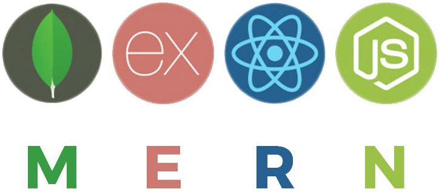
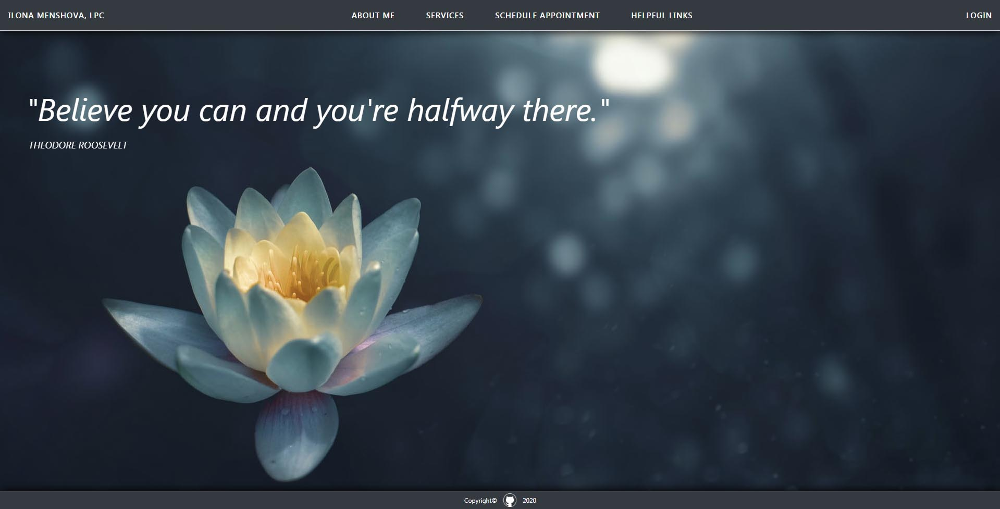
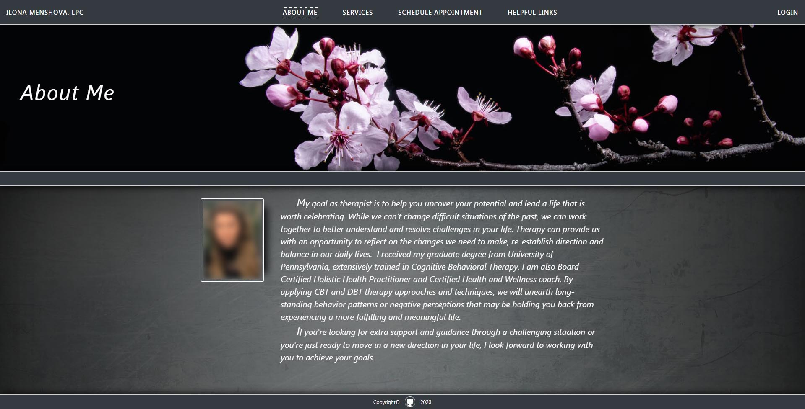
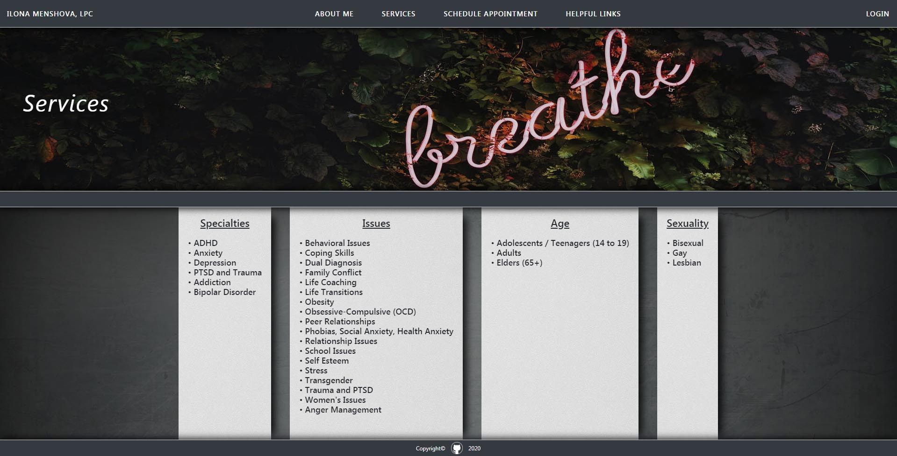
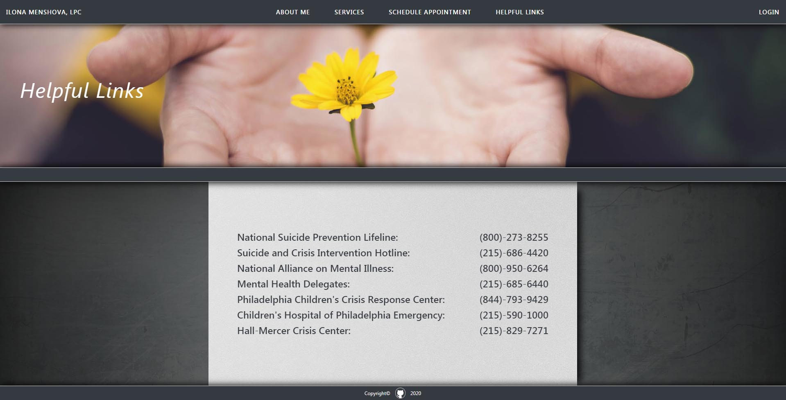
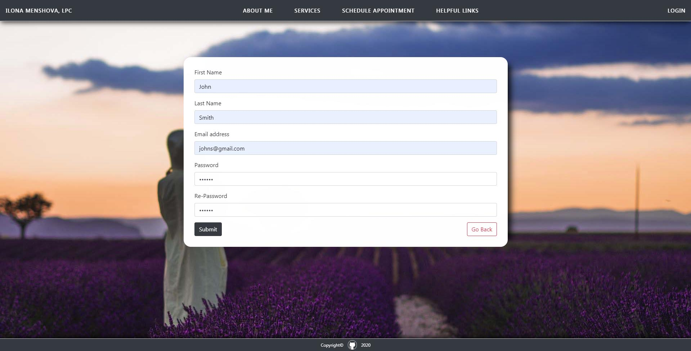
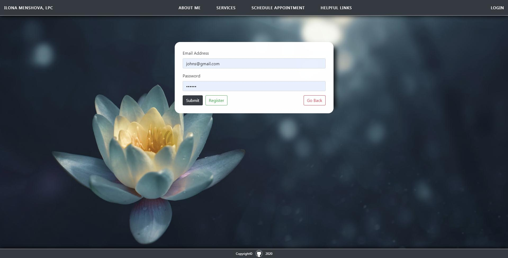
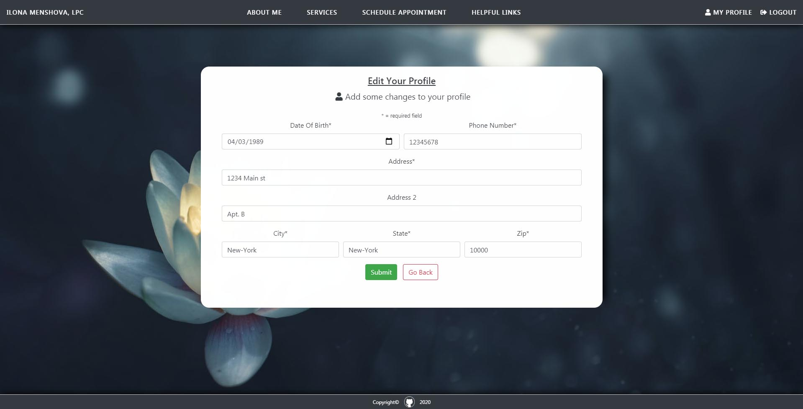
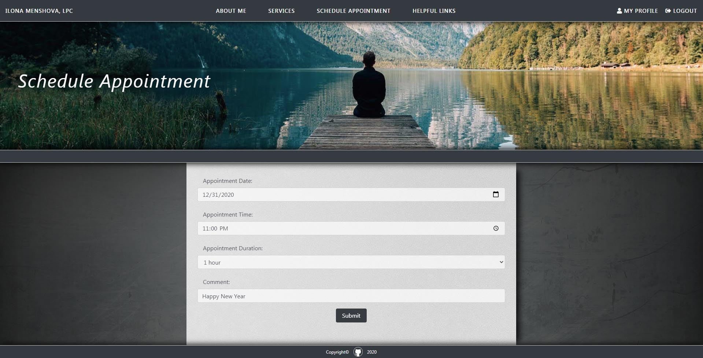
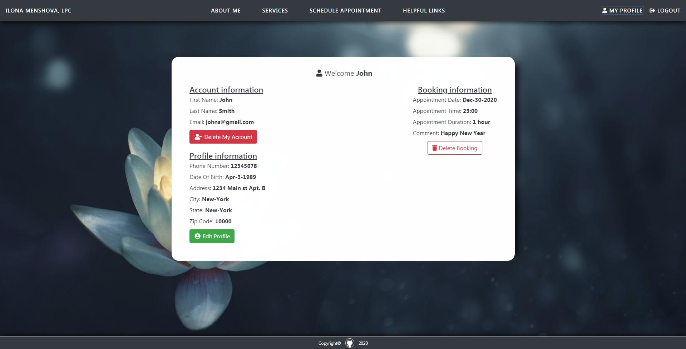

## Group Project 3

### Full Stack application

___

### Mental Health Private Practice

**We decided to make a page for mental health services. From the beginning of our project we knew we have to create easy to navigate page with unique feature which make your life easier. You just few simple clicks away from your scheduled appointment.**

### About Me

### Services

### Helpful Links

### Register

### Login

### Add/Edit Account

### Schedule Appointment

### Dashboard

___

### Project Contributors:

**[Evan Green](https://github.com/ThePalad1n)**

**[Jay Rodriguez](https://github.com/DntworryJayshere)**

**[Mike Gruschow](https://github.com/MikeGruschow)**

**[Yuriy Horbatenko](https://github.com/yuriyhorbatenko)**

___

### Technologies Used

* MERN - MongoDB, Express.js, React.js, Node.js
* React Redux
* Mongo Atlas
* Postman
* Javascript
* jQuery
* CSS
* HTML

___

### 07-27-2020